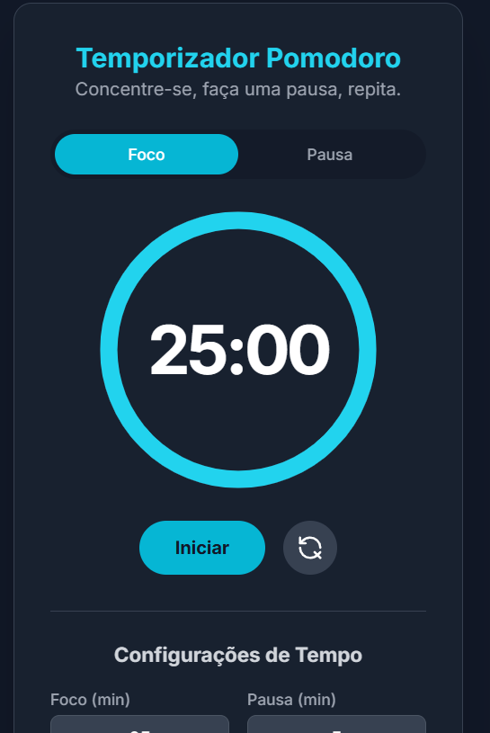

# ⏳ Temporizador Pomodoro

[](https://developer.mozilla.org/docs/Web/HTML)
[](https://tailwindcss.com/)
[](https://developer.mozilla.org/docs/Web/JavaScript)
[](LICENSE)

Um **temporizador Pomodoro** elegante e funcional, construído com **HTML**, **CSS (Tailwind)**
e **JavaScript**, com alertas sonoros usando **Tone.js**.

## 🖼️ Preview



## 🧠 Sobre o projeto

Criado para melhorar a produtividade pela técnica Pomodoro, com uma experiência intuitiva,
responsiva e personalizável. Permite alternar entre os modos **foco** e **pausa**, configurar
tempos personalizados e acompanhar o progresso com uma barra circular animada.

## ⚙️ Funcionalidades

- ✅ Alternar entre **Modo Foco** e **Modo Pausa**
- ✅ Contagem regressiva com **display digital** e barra de progresso circular animada
- ✅ Som de notificação ao fim de cada ciclo (Tone.js)
- ✅ Botões de **iniciar**, **pausar**, **continuar** e **resetar**
- ✅ Tempos de foco e pausa configuráveis (de 1 a 90 minutos)
- ✅ Interface moderna e responsiva com **Tailwind CSS**
- ✅ O título da aba do navegador atualiza com o tempo restante

## 🛠️ Tecnologias

- **HTML5**
- **Tailwind CSS**
- **JavaScript** (Vanilla JS)
- **Tone.js** — sons de notificação
- **Google Fonts** (Inter)

## ▶️ Como usar

```bash
git clone https://github.com/FelipeCJ07/Temporizador-Pomodoro.git
cd Temporizador-Pomodoro
```

Abra o `index.html` em um navegador moderno, configure os tempos de foco e pausa e clique em
**Iniciar**.

> 🔊 Ao iniciar, o navegador pode pedir permissão de áudio — necessária para os alertas sonoros (Tone.js).

## 📁 Estrutura

```
├── index.html   # estrutura da interface
├── style.css    # estilos complementares ao Tailwind
└── script.js    # lógica do temporizador
```

## ✨ Personalização

Os tons das notificações podem ser alterados em `script.js`:

```js
synth.triggerAttackRelease('C5', '8n', now);
synth.triggerAttackRelease('G5', '8n', now + 0.2);
```

## 📄 Licença

Distribuído sob a licença **MIT**. Veja [LICENSE](LICENSE).
